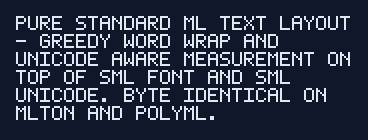

# sml-text-layout

[](https://github.com/sjqtentacles/sml-text-layout/actions/workflows/ci.yml)

Pure Standard ML **text layout**: Unicode-aware measurement and greedy line
breaking / word wrapping, built on top of
[`sml-font`](https://github.com/sjqtentacles/sml-font) (bitmap glyph advances)
and [`sml-unicode`](https://github.com/sjqtentacles/sml-unicode) (extended
grapheme-cluster segmentation + East-Asian display width).

The unit of layout is the **grapheme cluster** (UAX #29), so a base character
plus its combining marks stay together in one cell. A cluster's width in *cells*
is the sum of `Unicode.width` over its codepoints (combining marks add 0, wide
CJK characters count as 2); its width in *pixels* is that cell count times the
font's monospace cell advance. Because everything is integer cell/pixel
arithmetic over a bitmap font, results are exact and **byte-identical across
MLton and Poly/ML**.



This is layer B1a of the pure-SML GUI stack — the text engine
[`sml-ui`](https://github.com/sjqtentacles/sml-ui) uses to lay out labels,
buttons, text fields, and menus.

## API

```sml
structure TextLayout : sig
  type font = Font.font
  type glyphpos = { ch : string, x : int, y : int, w : int }   (* a cluster *)
  type line = { y : int, width : int, glyphs : glyphpos list }
  type layout = { width : int, height : int, lines : line list }

  val cellWidth     : font -> int                 (* monospace cell advance *)
  val graphemeWidth : font -> string -> int        (* Unicode-aware, in pixels *)
  val measure       : font -> string -> int * int  (* (width, height), \n aware *)
  val wrap : { font : font, maxWidth : int, lineHeight : int option }
             -> string -> layout
end
```

### Example

```sml
val font = Font.parseBdf (readFile "data/font5x7.bdf")  (* 6px cell, 7px tall *)

TextLayout.measure font "HELLO"          (* (30, 7) *)
TextLayout.graphemeWidth font "中"        (* 12  — a wide CJK cell is 2 *)

val { width, height, lines } =
  TextLayout.wrap { font = font, maxWidth = 168, lineHeight = NONE }
    "PURE STANDARD ML TEXT LAYOUT ..."
(* greedy word wrap: each line's glyphs carry exact integer (x, y, w) *)
```

## Layout model

- **Hard breaks.** Text is first split on `\n`; each paragraph wraps
  independently (a blank line between two paragraphs is preserved as an empty
  line).
- **Greedy word wrap.** Each paragraph is packed word-by-word into `maxWidth`
  pixels, breaking at inter-word spaces. A run of spaces between two words is a
  single break opportunity: its spaces are emitted as glyphs when the words stay
  on the same line, and dropped at a wrap boundary (no leading spaces on a
  continuation line).
- **Force break.** A single word wider than `maxWidth` is broken between
  grapheme clusters.
- **Line height.** `lineHeight = NONE` defaults to `Font.height font`; each
  line's `y` is its index times the line height.

## Scope (v1)

Bitmap monospace measurement only, chosen for determinism: **no** TTF
hinting, **no** complex shaping/ligatures, **no** bidirectional reordering, and
**no** hyphenation. Full shaping is out of scope; the integer cell model is what
keeps cross-compiler output byte-identical.

## Build & test

Requires [MLton](http://mlton.org/) and/or [Poly/ML](https://polyml.org/).

```sh
make test        # build + run the suite under MLton
make test-poly   # run the suite under Poly/ML
make all-tests   # both
make example     # render assets/wrapped.png + assets/wrapped.txt
make clean
```

## Installing with smlpkg

```sh
smlpkg add github.com/sjqtentacles/sml-text-layout
smlpkg sync
```

Reference `src/text_layout.mlb` from your own `.mlb` (MLton / MLKit), or feed
`test/sources.mlb` / `src/text_layout.mlb` to `tools/polybuild` (Poly/ML).

## Layout

```
sml.pkg                                       smlpkg manifest
Makefile                                      MLton + Poly/ML targets
.github/workflows/ci.yml                      CI: MLton + Poly/ML (Variant B)
data/font5x7.bdf                              vendored monospace BDF for tests/demo
src/
  text_layout.sig   TEXT_LAYOUT signature
  text_layout.sml   measurement + greedy word-wrap
  text_layout.mlb   library basis (pulls the vendored deps)
lib/github.com/sjqtentacles/                  vendored deps (byte-identical)
  sml-color/ sml-inflate/ sml-image/ sml-raster/ sml-font/ sml-unicode/
examples/
  demo.sml       wrap a paragraph -> assets/wrapped.png + assets/wrapped.txt
test/
  harness.sml    shared assertion harness
  test.sml       width / measure / wrap vectors (19 checks)
  entry.sml / main.sml
tools/polybuild  Poly/ML build wrapper
```

CI uses **Variant B** (Poly/ML 5.9.1 from source) to match `sml-font`'s variant
(it vendors the image/raster/font stack).

## Tests

19 deterministic checks: cell and Unicode-aware grapheme widths (ASCII, wide
CJK = 2 cells, combining mark = 0); multi-line `measure`; and greedy `wrap`
vectors with **exact glyph `(x, y, w)` positions** — single line equals the sum
of advances, splitting at the expected space, force-breaking an over-long word,
hard newlines, preserved blank lines, wide-character wrapping, and a custom line
height. Run `make all-tests` to verify identical output under MLton and Poly/ML.

## License

MIT. See [LICENSE](LICENSE).
